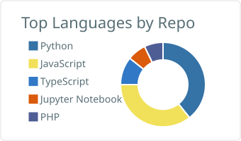
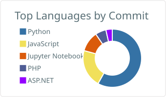

# Viraj Induruwa

**Freelance Software Engineer** at Sri Lanka Telecom (SLT) &nbsp;|&nbsp; BSc (Hons) Information Technology, Horizon Campus &nbsp;|&nbsp; Sri Lanka

---

## About

I'm a freelance software engineer based in Sri Lanka, currently working at Sri Lanka Telecom (SLT) on production systems that handle dealer commissions and sales incentive calculations. My work generally sits at the intersection of backend engineering, relational databases, and building tools that replace manual, spreadsheet driven processes with something reliable and auditable.

My day to day stack is Python and FastAPI on the backend, React on the front end, and PostgreSQL or Oracle for data. I've also spent time on desktop tooling (PySide6, Tkinter), mobile development with React Native and Expo, and I'm currently building toward SOC analyst fundamentals in cybersecurity.

**Currently:**
- Maintaining a production dealer commission engine for a telecom client, built on Python and cx_Oracle, handling slab based logic and multi stage validation
- Building a personal records and credential manager as a React Native mobile app
- Studying for cybersecurity certifications (TryHackMe, ISC2 CC) and running a home lab

---

## Technical Skills

**Languages**

**Backend & APIs**

**Frontend & Mobile**

**Databases**

**Cloud, DevOps & Tools**

**AI / ML**

---

## Selected Work

| Project | Description | Stack |
|---|---|---|
| **Sales Incentive Calculation System** | Production dealer commission engine for a telecom client. Handles slab based commission logic, PCR stage gating, and an Oracle to PostgreSQL migration | Python, cx_Oracle, Django |
| **SIA_DL_MI_System** | Dealer commission platform with slab override logic, negative commission handling for clawbacks, and cost tracking | FastAPI, PostgreSQL |
| **ExportHub** | Windows desktop app for PostgreSQL data operations: a SQL query library, a table join studio, and a custom recursive descent SQL parser for smart joins | Python, Tkinter, PostgreSQL |
| **DataDiff Pro** | Desktop file comparison tool with a themed UI and multi format export | Python, PySide6 |
| **Network Threat Monitoring Dashboard** | A mini SIEM built as a cybersecurity portfolio project, with GeoIP enrichment and live updates over WebSocket | FastAPI, TimescaleDB, React, Docker |
| **Cancer Detective Pro** | AI powered cancer detection web app, takes medical imaging input and returns a diagnostic prediction | Python, TensorFlow, FastAPI |
| **AllInOrder** | Personal records and credential manager, a mobile rebuild of a desktop application originally built for a university project | React Native, Expo, Drizzle ORM |

---

## GitHub Activity

  
  
   
  
  

---

## Contact

Open to freelance work, collaborations, and conversations about backend systems, data engineering, or cybersecurity.

